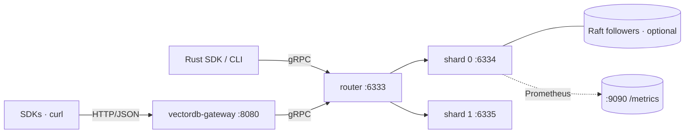

# VectorDB

Production-oriented, horizontally scalable vector database written in Rust — inspired by [Pinecone](https://www.pinecone.io/), designed for real workloads: embeddings search, RAG, recommendations, and similarity APIs.

> **Documentation:** start at **[`docs/`](docs/)** — index, getting-started, full architecture diagrams, REST/gRPC reference, and operations guides.
>
> Quick links: [Architecture & diagrams](docs/architecture.md) · [REST API](docs/api/rest.md) · [Filter DSL](docs/api/filter-dsl.md) · [Configuration](docs/guides/configuration.md) · [Clustering & Raft](docs/guides/clustering.md) · [RAG guide](docs/guides/rag.md) · [SDKs](docs/guides/sdks.md) · [Benchmarks](docs/benchmarks.md)

## Features

- **Approximate nearest neighbor (ANN)** via HNSW with configurable `M`, `ef_construction`, `ef_search`
- **Distance metrics**: cosine, Euclidean (L2²), dot product
- **Collections** (namespaces) with dimension + metric validation
- **JSON metadata + filter DSL**: `match`, `any_of`, `range`, `exists`, `must` / `must_not` / `should`
- **Payload indexes**: keyword, numeric (range), bool — accelerate filtered search
- **Durability**: write-ahead log (WAL) + RocksDB collection metadata
- **Snapshots & backups**: create / list / delete snapshots of the data directory
- **Replication**: Raft consensus per shard (3-node quorum supported)
- **Horizontal scaling**: consistent-hash sharding + query router (fan-out + merge top-k)
- **gRPC + REST APIs**: Tonic gRPC server, Axum HTTP/JSON gateway
- **Production ops (M2)**: API-key auth, optional TLS, Prometheus metrics, Raft leader discovery + auto-redirect
- **Hybrid search (M3)**: sparse vectors, BM25, RRF/weighted fusion, scalar quantization, SIMD distances
- **Bulk & ops (M4)**: bulk upsert, streaming import (gRPC), WAL compaction, online HNSW reindex
- **Rust SDK** (`vectordb-client`) and **CLI** (`vectordb`)
- **Language SDKs** (M5): Python, Node, Go, Java REST clients + RAG pipelines — see [`sdks/`](sdks/)

## Architecture



Full design diagrams (write/read paths, Raft replication, sharding, hybrid
search) live in **[`docs/architecture.md`](docs/architecture.md)**.

| Crate | Role |
|-------|------|
| `vectordb-core` | Vectors, metrics, HNSW |
| `vectordb-storage` | WAL, mmap segments, collection engine |
| `vectordb-cluster` | Consistent hash ring, shard router, membership |
| `vectordb-proto` | Protobuf / gRPC definitions |
| `vectordb-router` | Query router (fan-out + merge) |
| `vectordb-server` | Data or router node binary |
| `vectordb-gateway` | HTTP/JSON REST gateway |
| `vectordb-auth` | API-key validation (shared by server + gateway) |
| `vectordb-client` | Rust SDK |
| `vectordb-cli` | Admin CLI |

## Quick start

```bash
# Build
cargo build --release

# Run server (default :6334, data in ./data)
cargo run -p vectordb-server --release

# Create collection + upsert + search
cargo run -p vectordb-cli -- collections create embeddings --dim 3
cargo run -p vectordb-cli -- upsert embeddings doc-1 "0.1,0.2,0.3"
cargo run -p vectordb-cli -- search embeddings "0.1,0.2,0.3" --top-k 5
```

### Docker (2 shards + router + REST)

```bash
# On macOS (especially external drives): strip AppleDouble files first
./scripts/clean-macos-artifacts.sh

docker compose up --build
# gRPC router: localhost:6333
# REST gateway: http://localhost:8080
```

Compose mounts `config/router-docker.toml`, which points shards at `http://shard-0:6334` and `http://shard-1:6335` (Docker DNS). Local bare-metal cluster dev uses `config/router.toml` with `127.0.0.1` instead.

If build fails with `failed to xattr .../._Cargo.lock`, run the clean script above (or `find . -name '._*' -delete`) and rebuild. `.dockerignore` excludes these files from the build context.

After `docker compose up`, run the REST examples below in order: **`/health` → create collection → upsert → search** (upsert requires the collection to exist).

### Cluster (router + 2 data nodes)

```bash
# Terminal 1–2: data shards
cargo run -p vectordb-server -- --config config/node-0.toml
cargo run -p vectordb-server -- --config config/node-1.toml

# Terminal 3: router (single client endpoint)
cargo run -p vectordb-server -- --config config/router.toml

# Terminal 4: REST gateway → router
VECTORDB_GRPC=http://127.0.0.1:6333 cargo run -p vectordb-gateway
```

```bash
# REST example with metadata filtering
curl -s http://127.0.0.1:8080/health

# Create a collection with indexed payload fields
curl -s -X POST http://127.0.0.1:8080/v1/collections \
  -H 'Content-Type: application/json' \
  -d '{
        "name":"books",
        "dimension":3,
        "payload_indexes":[
          {"field":"category","kind":"keyword"},
          {"field":"price","kind":"numeric"}
        ]
      }'

# Upsert with JSON payload
curl -s -X POST http://127.0.0.1:8080/v1/collections/books/upsert \
  -H 'Content-Type: application/json' \
  -d '{
        "points":[
          {"id":"a","values":[1,0,0],"payload":{"category":"books","price":20}},
          {"id":"b","values":[0.95,0.1,0],"payload":{"category":"movies","price":15}}
        ]
      }'

# Filtered search: only "books" priced <= 50
curl -s -X POST http://127.0.0.1:8080/v1/collections/books/search \
  -H 'Content-Type: application/json' \
  -d '{
        "vector":[1,0,0],"top_k":5,
        "filter":{
          "must":[
            {"key":"category","match":{"value":"books"}},
            {"key":"price","range":{"lte":50}}
          ]
        }
      }'

# Snapshots
curl -s -X POST http://127.0.0.1:8080/v1/snapshots
curl -s http://127.0.0.1:8080/v1/snapshots
```

### Filter DSL (JSON)

```json
{
  "must":     [ {"key": "category", "match": {"value": "books"}} ],
  "must_not": [ {"key": "out_of_stock", "match": {"value": true}} ],
  "should":   [ {"key": "tags", "any_of": {"any": ["sale", "fiction"]}},
                {"key": "price", "range": {"gte": 10, "lte": 50}} ]
}
```

Supported field operators:

| Operator | Example |
|----------|---------|
| `match` | `{"key":"x", "match":{"value":"foo"}}` |
| `any_of` | `{"key":"tags", "any_of":{"any":["a","b"]}}` |
| `range` | `{"key":"price", "range":{"gte":10,"lte":50}}` |
| `exists` | `{"key":"sku", "exists":{"exists":true}}` |

## Configuration

See [`config/example.toml`](config/example.toml). Or use flags / env:

| Env | Description |
|-----|-------------|
| `VECTORDB_CONFIG` | Path to TOML config |
| `VECTORDB_LISTEN` | gRPC bind address |
| `VECTORDB_DATA_DIR` | Persistent data directory |
| `VECTORDB_NODE_ID` | Unique node identifier |

## Horizontal scaling

1. Run data nodes with distinct `shard_id` and shared `shard_count` (`config/node-0.toml`, `node-1.toml`, …).
2. Run a **router** (`role = "router"`) with `[[cluster.nodes]]` listing each shard's gRPC address (`config/router.toml`).
3. Point clients at the router (`:6333`) or **gateway** (`:8080`).

### Raft replication (3-node quorum)

Each shard can run as a Raft group. Writes go to the **leader** only; followers replicate via WAL entries.

```bash
cargo run -p vectordb-server -- --config config/replica-1.toml
cargo run -p vectordb-server -- --config config/replica-2.toml
cargo run -p vectordb-server -- --config config/replica-3.toml

# Writes auto-redirect to the leader (Rust SDK + router)
cargo run -p vectordb-cli -- --endpoint http://127.0.0.1:6334 collections create docs --dim 128
```

Raft RPC listens on `raft.listen` (default `7334+`). Data gRPC stays on `server.listen`. Configure `raft.peers[].grpc` for leader discovery.

### Hybrid search (M3)

```bash
# Create collection with BM25 on payload.text + sparse index
curl -s -X POST http://127.0.0.1:8080/v1/collections \
  -H 'Content-Type: application/json' \
  -d '{
        "name":"hybrid",
        "dimension":3,
        "bm25_text_field":"text",
        "sparse_enabled":true
      }'

# Upsert dense + payload text + optional sparse
curl -s -X POST http://127.0.0.1:8080/v1/collections/hybrid/upsert \
  -H 'Content-Type: application/json' \
  -d '{
        "points":[{
          "id":"a",
          "values":[1,0,0],
          "payload":{"text":"rust vector database"},
          "sparse":{"indices":[10,20],"values":[1.0,0.5]}
        }]
      }'

# Hybrid RRF: dense ANN + BM25 + sparse
curl -s -X POST http://127.0.0.1:8080/v1/collections/hybrid/search \
  -H 'Content-Type: application/json' \
  -d '{
        "vector":[1,0,0],
        "text_query":"vector database",
        "sparse_query":{"indices":[10],"values":[1.0]},
        "search_mode":"hybrid_rrf",
        "top_k":5
      }'
```

Search modes: `dense` (default), `sparse`, `bm25`, `hybrid_rrf`, `hybrid_weighted` (use `hybrid_alpha`).

### Bulk import, WAL compaction, reindex (M4)

```bash
# Bulk upsert (chunked WAL records, default chunk_size=500)
curl -s -X POST http://127.0.0.1:8080/v1/collections/embeddings/bulk \
  -H 'Content-Type: application/json' \
  -d '{"points":[{"id":"b1","values":[0.1,0.2,0.3]},{"id":"b2","values":[0.4,0.5,0.6]}],"chunk_size":500}'

# Compact WAL (optional snapshot first)
curl -s -X POST http://127.0.0.1:8080/v1/admin/compact-wal \
  -H 'Content-Type: application/json' \
  -d '{"snapshot_first":true}'

# Rebuild HNSW from stored vectors
curl -s -X POST http://127.0.0.1:8080/v1/collections/embeddings/reindex
```

gRPC: `BulkUpsert`, `ImportStream` (client streaming), `CompactWal`, `ReindexCollection`.

### Language SDKs (M5)

REST clients target the gateway (`:8080`). Each includes a **RAG pipeline** (chunk → embed → upsert → search).

```bash
# Python
pip install -e sdks/python && python sdks/python/examples/rag_demo.py

# Node
cd sdks/nodejs && npm install && npm run build && node examples/rag-demo.mjs

# Go
cd sdks/go && go run ./examples/rag_demo

# Java
cd sdks/java && mvn -q exec:java -Dexec.mainClass=dev.vectordb.RagDemo
```

```python
from vectordb import VectorDbClient, RagPipeline

client = VectorDbClient("http://127.0.0.1:8080", api_key="...")
rag = RagPipeline(client, "kb", dimension=1536, embed=my_embed_fn)
rag.ingest([{"id": "1", "text": "Your document text..."}])
print(rag.query("your question", top_k=5, rerank=True))
```

See [`sdks/README.md`](sdks/README.md) for full API coverage.

### Auth, metrics, and probes (M2)

```bash
# Server with API keys + Prometheus on :9090
cargo run -p vectordb-server -- --config config/example-secure.toml

# Gateway with the same key
VECTORDB_API_KEYS=dev-secret-key-change-me \
  VECTORDB_GRPC=http://127.0.0.1:6334 \
  cargo run -p vectordb-gateway

# Probes (no API key required)
curl -s http://127.0.0.1:8080/live
curl -s http://127.0.0.1:8080/ready
curl -s http://127.0.0.1:9090/metrics | head

# Authenticated request
curl -s -H 'x-api-key: dev-secret-key-change-me' http://127.0.0.1:8080/v1/collections
```

**Roadmap**:

- [x] Query router with fan-out merge
- [x] HTTP/JSON REST gateway
- [x] Raft replication per shard (tonic Raft RPC + quorum commits)
- [x] Metadata filtering (JSON payloads + payload indexes)
- [x] Snapshots + backups
- [x] Automatic leader discovery + client redirect (`x-vectordb-leader`)
- [x] Auth (API keys + optional TLS)
- [x] Prometheus metrics + structured query logs
- [x] Sparse vectors + hybrid (BM25 + RRF) search
- [x] Scalar quantization + SIMD distance kernels
- [x] Bulk import + WAL compaction + online reindex
- [x] Python / Node SDKs + RAG helpers (M5)

## Development

```bash
cargo test --workspace
./scripts/benchmark.sh
cargo bench -p vectordb-core
cargo bench -p vectordb-storage
```

See [`docs/benchmarks.md`](docs/benchmarks.md) for the full benchmark guide.

## License

Apache-2.0
