# Architecture & Design

VectorDB is a Rust workspace of focused crates, deployable as one of three node
roles (`data`, `router`, `all_in_one`) plus an optional REST `gateway` and a
Prometheus metrics endpoint. This page describes how data flows through the
system and how each piece fits together.

> Diagrams use [Mermaid](https://mermaid.js.org/). GitHub, VS Code, and most
> Markdown viewers render them inline.

---

## 1. High-level system

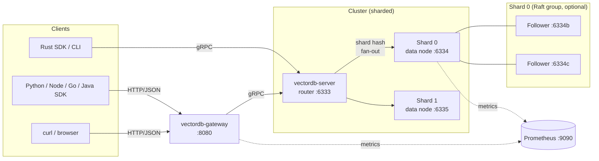

- **Gateway** translates REST → gRPC and adds API-key auth.
- **Router** owns the shard map, fans out queries, and merges top-k results.
- **Data nodes** own the HNSW index, WAL, RocksDB metadata, and (optionally)
  a Raft group for replication.
- **Prometheus** scrapes `/metrics` from server and gateway.

---

## 2. Crates & responsibilities

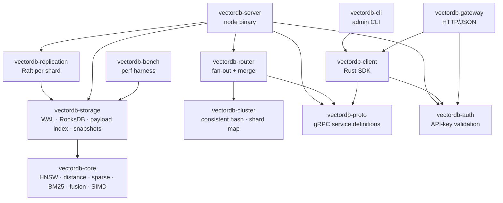

| Crate | Role |
|-------|------|
| `vectordb-core` | Vectors, metrics, HNSW, sparse, BM25, fusion, SIMD, scalar quant |
| `vectordb-storage` | WAL, RocksDB metadata, payload index, snapshots, search orchestration |
| `vectordb-replication` | Raft node per shard |
| `vectordb-cluster` | Consistent-hash ring, shard router |
| `vectordb-proto` | Protobuf + tonic generated stubs |
| `vectordb-auth` | Shared `Bearer` / `x-api-key` checking |
| `vectordb-server` | Process binary (data, router, all-in-one) |
| `vectordb-router` | Fan-out + merge top-k as a `VectorService` impl |
| `vectordb-client` | Async gRPC SDK with leader auto-redirect |
| `vectordb-cli` | `vectordb` admin CLI |
| `vectordb-gateway` | Axum REST/JSON façade |
| `vectordb-bench` | Quick performance harness |

---

## 3. Storage layout

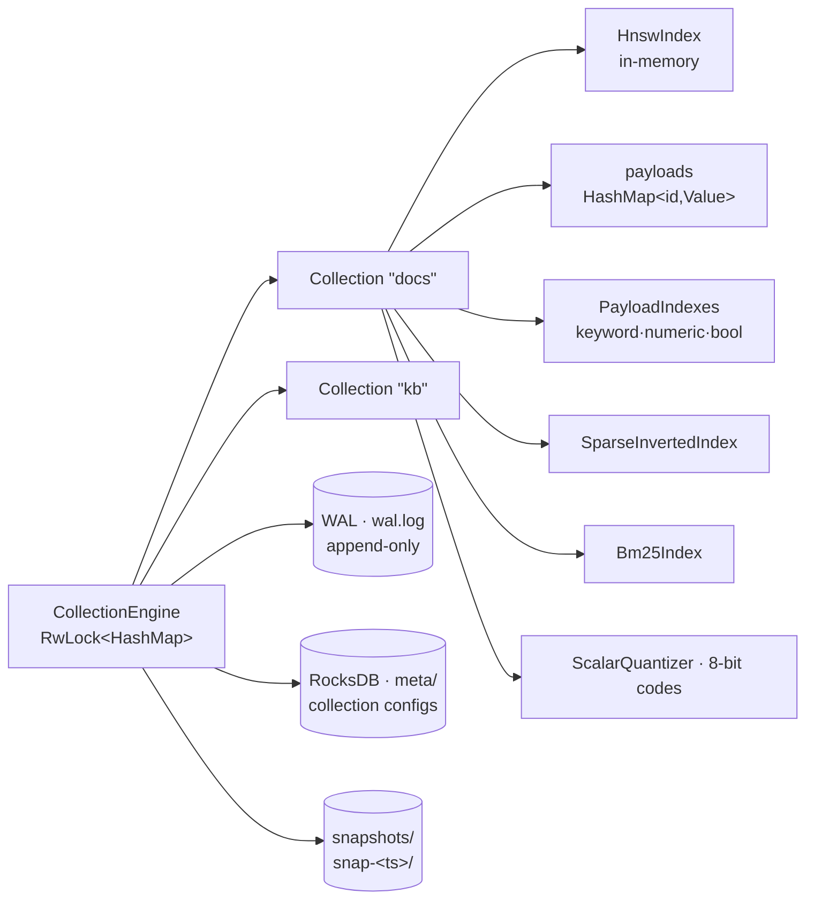

- The HNSW graph and payloads live in **memory**; the WAL + RocksDB give
  durability and crash recovery on restart.
- Snapshots are **filesystem copies** of `wal.log` + `meta/` taken atomically
  and labelled by timestamp.

---

## 4. Write path

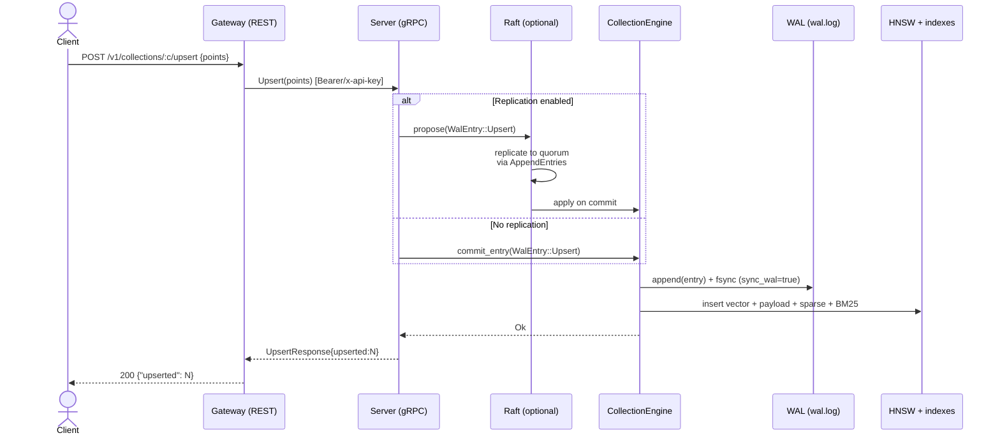

- **Leader-only writes**: in Raft mode, followers return `not leader` and the
  client SDK auto-redirects using the `x-vectordb-leader` metadata.
- **WAL first, index second**: entries are durable before HNSW mutation, so
  crashes replay cleanly.

---

## 5. Read path (search)

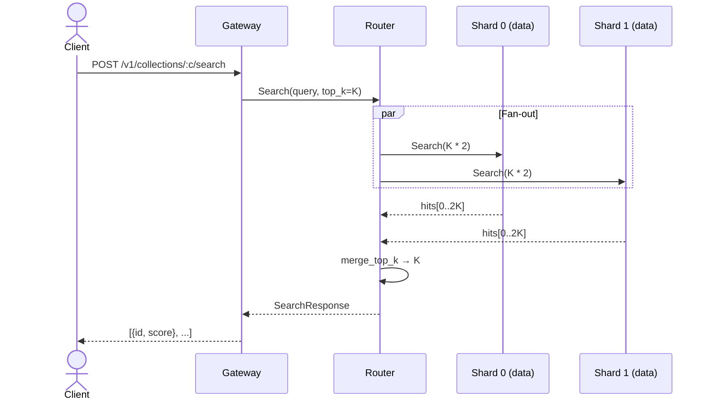

Per shard, search resolves dense / sparse / BM25 / hybrid based on the request:

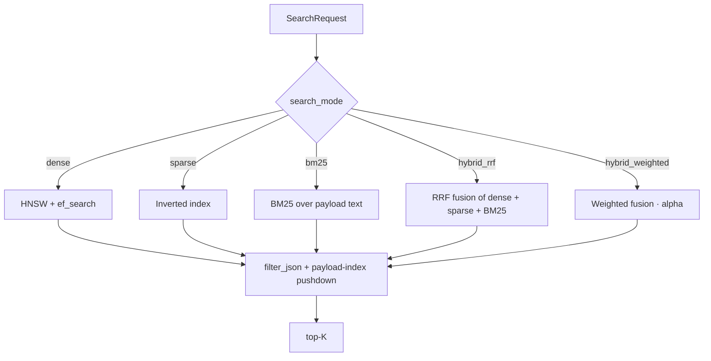

For filtered search the engine picks the cheaper plan:

- If a payload-indexed filter is **selective** (≤ 50k candidate ids), brute-force
  distance over the candidate set.
- Otherwise oversearch HNSW (`k · 16`, capped) and post-filter.

---

## 6. Sharding

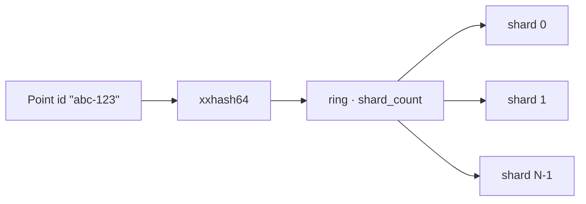

- Sharding is **consistent-hash** over `point.id` (`xxhash64 % shard_count`).
- The router holds `[[cluster.nodes]]` with each node’s `grpc` and the shards
  it owns.
- Each shard is independent; cross-shard traffic only happens at the router
  during fan-out search.

---

## 7. Replication (Raft)

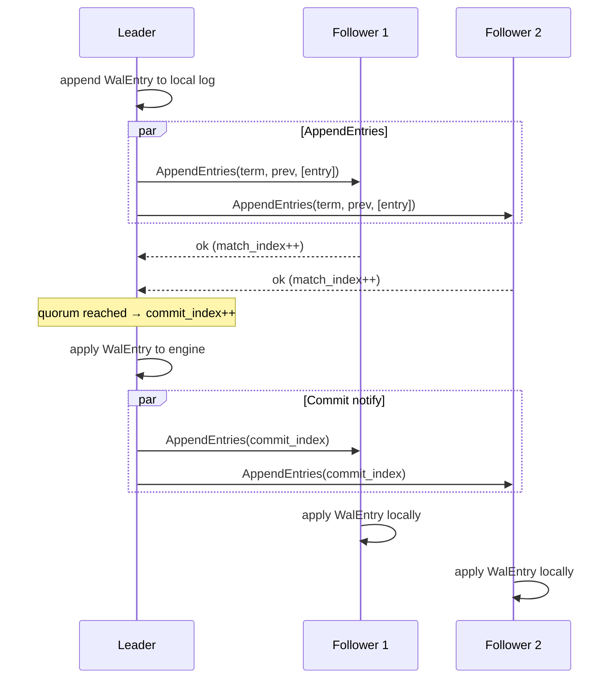

Election timeouts and heartbeat intervals are configured under `[raft]` in the
node TOML. Each shard is its own Raft group; for `shard_count = N` and
replication factor `R`, you run `N · R` data nodes.

The leader’s gRPC endpoint is advertised in `HealthResponse.leader_endpoint`
and in error metadata `x-vectordb-leader`. SDKs use this to redirect writes.

---

## 8. Bulk import & WAL compaction

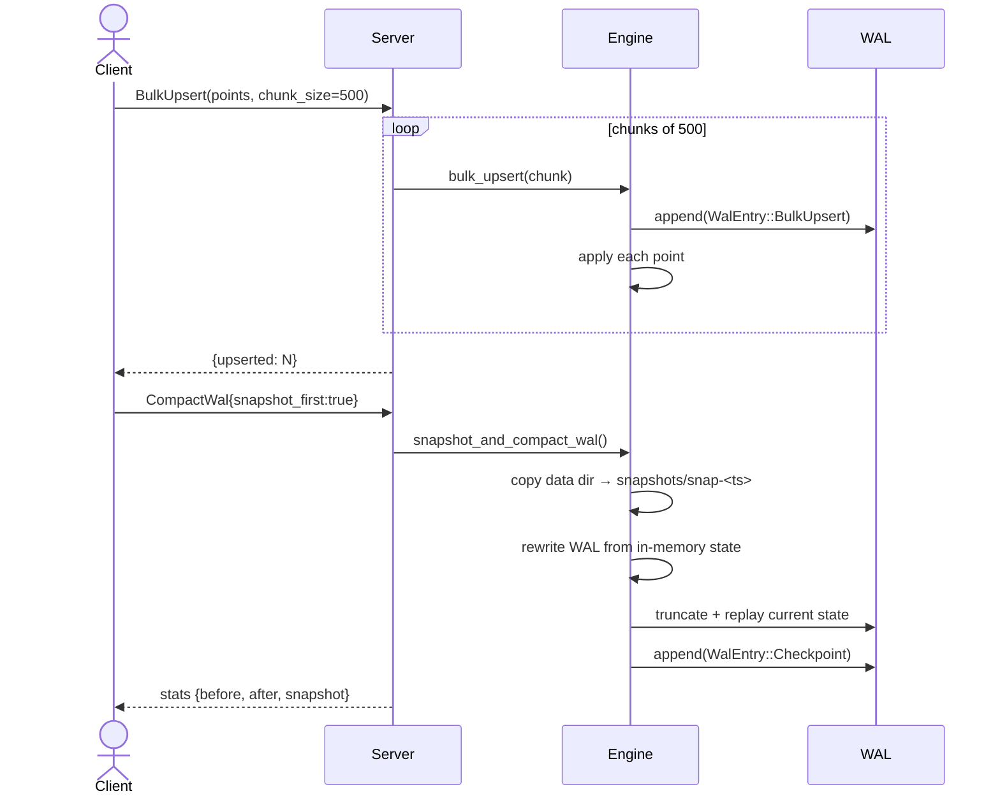

For client streaming, `ImportStream` accepts `ImportChunk`s with a `finalize`
flag to flush remaining buffer and ack one cumulative count.

---

## 9. Online reindex

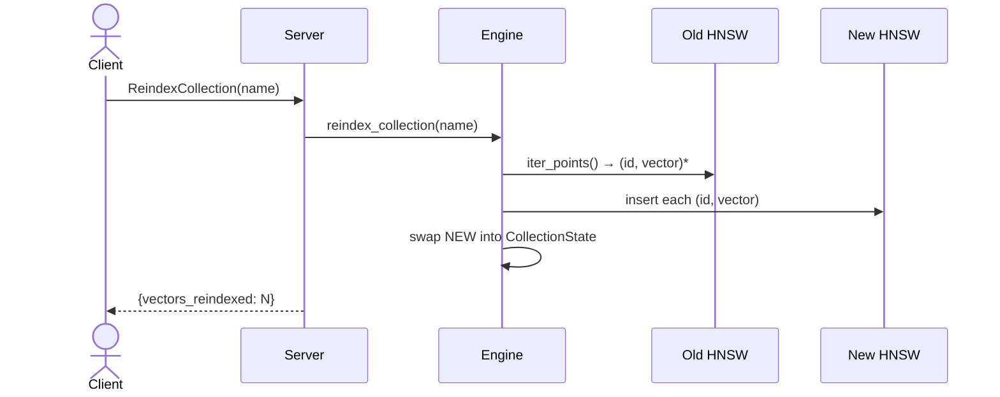

Reindex is **online**: reads continue against the old index until the swap
(under a single write lock) replaces it.

---

## 10. Hybrid search internals

```mermaid
flowchart TB
    DQ[dense query] --> HNSW
    SQ[sparse query] --> SIDX[sparse inverted index]
    TQ[text query] --> BM25
    HNSW --> Hd[hits_d]
    SIDX --> Hs[hits_s]
    BM25 --> Hb[hits_b]
    Hd --> FU{mode}
    Hs --> FU
    Hb --> FU
    FU -->|hybrid_rrf| RRF[RRF fusion · 1/(60+rank)]
    FU -->|hybrid_weighted| WW[α·dense + (1-α)·lexical]
    RRF --> R[top-K]
    WW --> R
```

See [`guides/hybrid-search.md`](guides/hybrid-search.md) for usage.

---

## 11. Memory & disk model

| Layer | Lives in | Persisted? | Recovery |
|-------|---------|------------|----------|
| HNSW graph | RAM | ✗ | Replayed from WAL |
| Payloads | RAM | ✗ | Replayed from WAL |
| Sparse / BM25 indexes | RAM | ✗ | Replayed from WAL |
| WAL (`wal.log`) | Disk | ✓ (append-only) | Read on startup |
| Collection metadata | RocksDB (`meta/`) | ✓ | Read on startup |
| Snapshots | `snapshots/snap-<ts>/` | ✓ | Manual restore |
| Quantized codes | RAM | rebuilt | After enabling on a collection |

To restore from a snapshot, copy `snap-<ts>/wal.log` and `snap-<ts>/meta/` into
the data directory and start the server.

---

## 12. Deployment topologies

### Single node (dev / small)
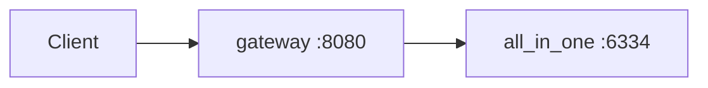

### Sharded (no replication)
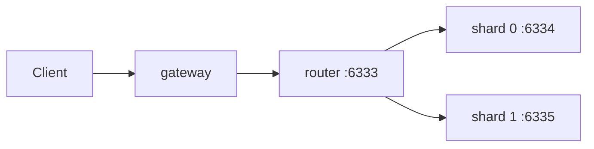

### Sharded + Raft (HA)
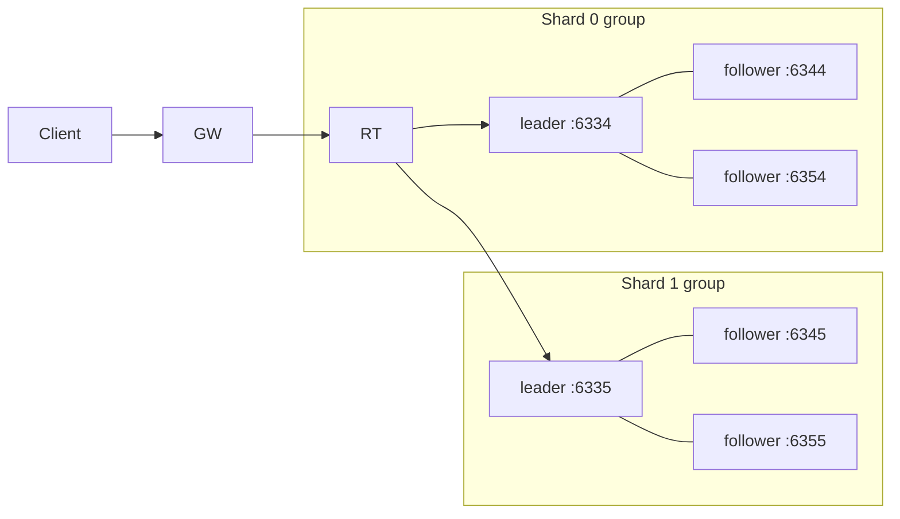

The router or any SDK can talk directly to a leader; followers reject writes
and return the leader endpoint for redirect.

---

## 13. Failure handling

| Failure | Behaviour |
|---------|-----------|
| Single node crash | WAL replay restores in-memory state on restart |
| Leader crash (Raft) | Follower wins election; SDK redirects writes to new leader |
| Disk corruption | Restore from latest snapshot in `snapshots/` |
| Router crash | Restart; routers are stateless |
| Gateway crash | Restart; gateway is stateless |

---

## 14. Where to read the code

- HNSW algorithm: `crates/vectordb-core/src/hnsw.rs`
- SIMD distance: `crates/vectordb-core/src/simd.rs`
- Filter DSL: `crates/vectordb-core/src/filter.rs`
- Engine + WAL: `crates/vectordb-storage/src/{engine.rs, wal.rs}`
- Snapshots: `crates/vectordb-storage/src/snapshot.rs`
- Hybrid search: `crates/vectordb-storage/src/search.rs`
- Raft: `crates/vectordb-replication/src/{node.rs, rpc.rs}`
- Router fan-out: `crates/vectordb-router/src/service.rs`
- Server endpoints: `crates/vectordb-server/src/service.rs`
- Gateway routes: `crates/vectordb-gateway/src/main.rs`
